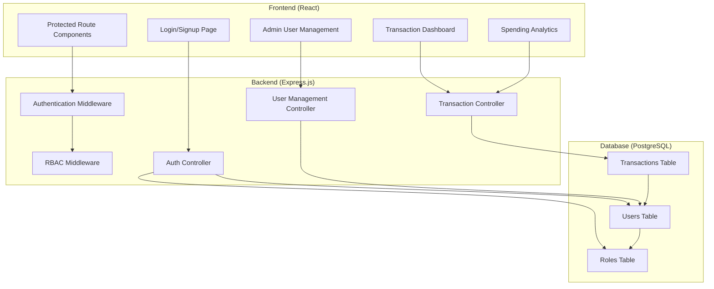
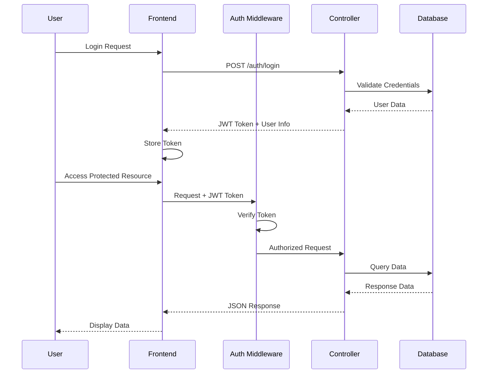
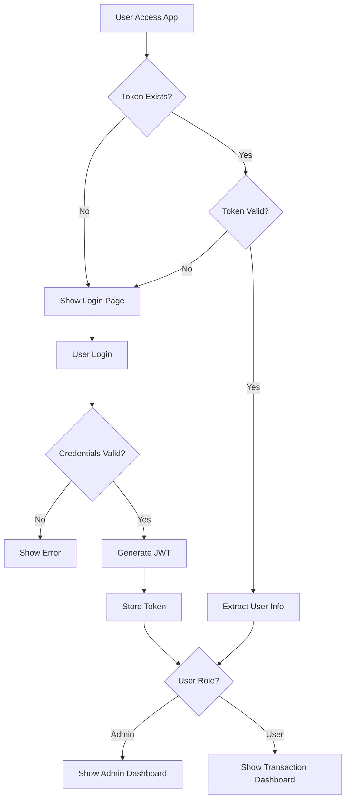

# Personal Finance Manager - Design Document

## Overview

The Personal Finance Manager is a full-stack PERN (PostgreSQL, Express.js, React.js, Node.js) application that provides comprehensive financial tracking capabilities with role-based access control. The system enables users to manage their income and expenses while providing administrators with user management capabilities.

### Key Features

- JWT-based authentication with role-based access control (RBAC)
- Transaction management with categorization and notes
- Spending analytics and filtering capabilities
- Administrative user management with search functionality
- Secure API endpoints with middleware protection
- Real-time data synchronization between frontend and backend

### Technology Stack

- **Frontend**: React.js with functional components and hooks
- **Backend**: Express.js REST API server
- **Database**: PostgreSQL with proper relational design
- **Authentication**: JWT tokens with bcrypt password hashing
- **HTTP Client**: Axios for API communication

## Architecture

### System Architecture



### Data Flow Architecture



## Components and Interfaces

### Database Schema

#### Users Table

```sql
CREATE TABLE users (
    id INTEGER PRIMARY KEY,
    email VARCHAR(255) UNIQUE NOT NULL,
    password VARCHAR(255) NOT NULL,
    roleid INTEGER REFERENCES roles(id),
    status VARCHAR(20) DEFAULT 'active',
    created_at TIMESTAMP DEFAULT CURRENT_TIMESTAMP,
    updated_at TIMESTAMP DEFAULT CURRENT_TIMESTAMP
);
```

#### Roles Table

```sql
CREATE TABLE roles (
    id INTEGER PRIMARY KEY,
    name VARCHAR(50) UNIQUE NOT NULL
);

-- Seed data
INSERT INTO roles (id, name) VALUES (1, 'admin'), (2, 'user');
```

#### Transactions Table

```sql
CREATE TABLE transactions (
    id UUID PRIMARY KEY DEFAULT gen_random_uuid(),
    user_id INTEGER REFERENCES users(id) ON DELETE CASCADE,
    amount NUMERIC(12,2) NOT NULL,
    category VARCHAR(100) NOT NULL,
    description TEXT,
    notes TEXT,
    transaction_date DATE NOT NULL,
    created_at TIMESTAMP DEFAULT CURRENT_TIMESTAMP,
    updated_at TIMESTAMP DEFAULT CURRENT_TIMESTAMP
);

CREATE INDEX idx_transactions_user_id ON transactions(user_id);
CREATE INDEX idx_transactions_date ON transactions(transaction_date);
CREATE INDEX idx_transactions_category ON transactions(category);
```

### API Endpoints

#### Authentication Endpoints

```javascript
// POST /api/auth/register
{
  "email": "user@example.com",
  "password": "securePassword",
  "role": "user" // optional, defaults to "user"
}

// Response
{
  "success": true,
  "message": "User registered successfully",
  "user": {
    "id": 1,
    "email": "user@example.com",
    "role": "user"
  }
}

// POST /api/auth/login
{
  "email": "user@example.com",
  "password": "securePassword"
}

// Response
{
  "success": true,
  "token": "eyJhbGciOiJIUzI1NiIsInR5cCI6IkpXVCJ9...",
  "user": {
    "id": 1,
    "email": "user@example.com",
    "role": "user"
  }
}
```

#### Transaction Endpoints

```javascript
// GET /api/transactions?startDate=2024-01-01&endDate=2024-12-31
// Headers: Authorization: Bearer <token>
// Response
{
  "success": true,
  "transactions": [
    {
      "id": 1,
      "amount": "150.00",
      "category": "Food",
      "description": "Grocery shopping",
      "notes": "Weekly groceries at supermarket",
      "transaction_date": "2024-01-15",
      "created_at": "2024-01-15T10:30:00Z"
    }
  ]
}

// POST /api/transactions
{
  "amount": 150.00,
  "category": "Food",
  "description": "Grocery shopping",
  "notes": "Weekly groceries",
  "transaction_date": "2024-01-15"
}

// GET /api/transactions/summary
// Response
{
  "success": true,
  "summary": {
    "Food": "450.00",
    "Rent": "1200.00",
    "Salary": "3000.00"
  },
  "totalIncome": "3000.00",
  "totalExpenses": "1650.00"
}
```

#### Admin User Management Endpoints

```javascript
// GET /api/admin/users?search=john&status=active
// Headers: Authorization: Bearer <admin_token>
// Response
{
  "success": true,
  "users": [
    {
      "id": 1,
      "email": "john@example.com",
      "role": "user",
      "status": "active",
      "created_at": "2024-01-01T00:00:00Z"
    }
  ]
}

// PUT /api/admin/users/:id
{
  "email": "newemail@example.com",
  "role": "admin",
  "status": "inactive"
}

// POST /api/admin/users
{
  "email": "newuser@example.com",
  "password": "tempPassword",
  "role": "user"
}
```

### React Component Architecture

#### Component Hierarchy

```
App
├── AuthProvider (Context)
├── Router
│   ├── PublicRoute
│   │   └── LoginSignup
│   └── ProtectedRoute
│       ├── TransactionDashboard
│       │   ├── TransactionForm
│       │   ├── TransactionList
│       │   ├── DateFilter
│       │   └── SummaryCard
│       └── AdminPanel (Admin Only)
│           ├── UserSearch
│           ├── UserTable
│           └── UserForm
```

#### Key Components

**AuthProvider Context**

```javascript
const AuthContext = createContext();

export const AuthProvider = ({ children }) => {
  const [user, setUser] = useState(null);
  const [token, setToken] = useState(localStorage.getItem("token"));

  const login = async (credentials) => {
    // Login logic with API call
  };

  const logout = () => {
    // Clear token and user state
  };

  return (
    <AuthContext.Provider value={{ user, token, login, logout }}>
      {children}
    </AuthContext.Provider>
  );
};
```

**ProtectedRoute Component**

```javascript
const ProtectedRoute = ({ children, requiredRole }) => {
  const { user, token } = useAuth();

  if (!token) {
    return <Navigate to="/login" />;
  }

  if (requiredRole && user?.role !== requiredRole) {
    return <Navigate to="/dashboard" />;
  }

  return children;
};
```

**TransactionDashboard Component**

```javascript
const TransactionDashboard = () => {
  const [transactions, setTransactions] = useState([]);
  const [summary, setSummary] = useState({});
  const [dateFilter, setDateFilter] = useState({});

  const fetchTransactions = useCallback(async () => {
    // API call with date filters
  }, [dateFilter]);

  return (
    <div className="dashboard">
      <SummaryCard summary={summary} />
      <DateFilter onFilterChange={setDateFilter} />
      <TransactionForm onTransactionAdded={fetchTransactions} />
      <TransactionList transactions={transactions} />
    </div>
  );
};
```

### Project Structure

```
personal-finance-manager/
├── ui/                          # React Frontend
│   ├── public/
│   │   └── index.html
│   ├── src/
│   │   ├── components/
│   │   │   ├── auth/
│   │   │   │   ├── LoginSignup.jsx
│   │   │   │   └── ProtectedRoute.jsx
│   │   │   ├── transactions/
│   │   │   │   ├── TransactionDashboard.jsx
│   │   │   │   ├── TransactionForm.jsx
│   │   │   │   ├── TransactionList.jsx
│   │   │   │   ├── DateFilter.jsx
│   │   │   │   └── SummaryCard.jsx
│   │   │   └── admin/
│   │   │       ├── AdminPanel.jsx
│   │   │       ├── UserSearch.jsx
│   │   │       ├── UserTable.jsx
│   │   │       └── UserForm.jsx
│   │   ├── contexts/
│   │   │   └── AuthContext.js
│   │   ├── services/
│   │   │   └── api.js
│   │   ├── utils/
│   │   │   └── constants.js
│   │   ├── App.js
│   │   └── index.js
│   ├── package.json
│   └── .env
└── node/                        # Express Backend
    ├── src/
    │   ├── controllers/
    │   │   ├── authController.js
    │   │   ├── transactionController.js
    │   │   └── userController.js
    │   ├── middleware/
    │   │   ├── auth.js
    │   │   └── rbac.js
    │   ├── models/
    │   │   └── database.js
    │   ├── routes/
    │   │   ├── auth.js
    │   │   ├── transactions.js
    │   │   └── users.js
    │   ├── config/
    │   │   └── database.js
    │   └── app.js
    ├── package.json
    └── .env
```

## Data Models

### User Model

```javascript
class User {
  constructor(id, email, password, roleid, status) {
    this.id = id;
    this.email = email;
    this.password = password; // bcrypt hashed
    this.roleid = roleid;
    this.status = status;
  }

  static async create(userData) {
    // Hash password and insert into database
  }

  static async findByEmail(email) {
    // Query user by email
  }

  async validatePassword(password) {
    // Compare with bcrypt
  }
}
```

### Transaction Model

```javascript
class Transaction {
  constructor(
    id,
    userId,
    amount,
    category,
    description,
    notes,
    transactionDate,
  ) {
    this.id = id;
    this.userId = userId;
    this.amount = amount;
    this.category = category;
    this.description = description;
    this.notes = notes;
    this.transactionDate = transactionDate;
  }

  static async findByUserId(userId, filters = {}) {
    // Query transactions with optional date filtering
  }

  static async getSummaryByUserId(userId) {
    // Aggregate spending by category
  }

  static async create(transactionData) {
    // Insert new transaction
  }
}
```

### Authentication Flow



## Correctness Properties

_A property is a characteristic or behavior that should hold true across all valid executions of a system-essentially, a formal statement about what the system should do. Properties serve as the bridge between human-readable specifications and machine-verifiable correctness guarantees._

### Property 1: User Registration with Secure Password Storage

_For any_ valid user registration data, the authentication service should create a new user account with a bcrypt-hashed password and active status by default.

**Validates: Requirements 1.1, 1.8, 1.9**

### Property 2: JWT Authentication Round Trip

_For any_ valid user credentials, logging in should return a JWT token that contains the correct user role information and can be used to access protected resources.

**Validates: Requirements 1.2, 3.3**

### Property 3: Invalid Credentials Rejection

_For any_ invalid login credentials (wrong email, wrong password, or non-existent user), the authentication service should return an authentication error.

**Validates: Requirements 1.3**

### Property 4: Role-Based Access Control Enforcement

_For any_ protected endpoint and user role combination, access should be granted only when the user's role has the required permissions for that endpoint.

**Validates: Requirements 1.10, 9.5**

### Property 5: JWT Token Protection

_For any_ request to a protected endpoint without a valid JWT token, the system should return an unauthorized error.

**Validates: Requirements 3.1, 3.2**

### Property 6: Transaction Data Isolation

_For any_ authenticated user, when they create transactions and request their transaction history, they should only see their own transactions and not those of other users.

**Validates: Requirements 2.1, 2.5**

### Property 7: Financial Precision Preservation

_For any_ transaction amount with high precision (multiple decimal places), storing and retrieving the transaction should maintain the exact precision without rounding errors.

**Validates: Requirements 2.3, 8.1**

### Property 8: Transaction Category Support

_For any_ transaction with a category (including Food, Rent, Salary, or custom categories), the system should accept and store the category correctly.

**Validates: Requirements 2.6**

### Property 9: Spending Summary Accuracy

_For any_ user's transaction history, the spending summary should correctly aggregate totals by category and provide separate totals for income and expense categories.

**Validates: Requirements 4.1, 4.4**

### Property 10: Date Range Filtering

_For any_ user's transactions and date range parameters (startDate, endDate), the system should return only transactions within the specified date range, or all transactions when no date parameters are provided.

**Validates: Requirements 5.1, 5.3**

### Property 11: API Response Consistency

_For any_ API endpoint response, the returned JSON should follow a consistent format structure across all endpoints.

**Validates: Requirements 6.4**

### Property 12: Database Referential Integrity

_For any_ attempt to create a transaction with an invalid user_id or delete a user with existing transactions, the database should enforce referential integrity constraints appropriately.

**Validates: Requirements 8.2**

### Property 13: Database Error Handling

_For any_ database operation failure, the backend API should return appropriate error responses with meaningful error messages.

**Validates: Requirements 8.3, 12.5**

### Property 14: Admin User Management

_For any_ admin user, they should be able to retrieve all users, update user information, change user status, and create new users with specified roles.

**Validates: Requirements 9.1, 9.2, 9.3, 9.6**

### Property 15: User Search Functionality

_For any_ search criteria (name, email, or status), the admin user search should return only users matching the specified criteria.

**Validates: Requirements 10.1**

## Error Handling

### Authentication Errors

- **Invalid Credentials**: Return 401 Unauthorized with clear error message
- **Missing JWT Token**: Return 401 Unauthorized for protected routes
- **Expired JWT Token**: Return 401 Unauthorized with token refresh guidance
- **Insufficient Permissions**: Return 403 Forbidden for role-restricted endpoints

### Database Errors

- **Connection Failures**: Return 503 Service Unavailable with retry guidance
- **Constraint Violations**: Return 400 Bad Request with specific constraint information
- **Data Validation Errors**: Return 400 Bad Request with field-specific error details
- **Transaction Failures**: Rollback changes and return appropriate error status

### API Errors

- **Malformed Requests**: Return 400 Bad Request with validation details
- **Resource Not Found**: Return 404 Not Found for non-existent resources
- **Server Errors**: Return 500 Internal Server Error with error tracking ID
- **Rate Limiting**: Return 429 Too Many Requests with retry-after header

### Frontend Error Handling

- **Network Errors**: Display user-friendly offline/connectivity messages
- **API Errors**: Show contextual error messages based on error type
- **Validation Errors**: Highlight form fields with specific error messages
- **Session Expiry**: Redirect to login with session timeout notification

### Error Response Format

```javascript
{
  "success": false,
  "error": {
    "code": "INVALID_CREDENTIALS",
    "message": "Invalid email or password",
    "details": {
      "field": "password",
      "reason": "Password does not match"
    }
  },
  "timestamp": "2024-01-15T10:30:00Z",
  "requestId": "req_123456789"
}
```

## Testing Strategy

### Dual Testing Approach

The Personal Finance Manager will implement a comprehensive testing strategy combining unit tests and property-based tests to ensure both specific functionality and universal correctness guarantees.

#### Unit Testing

Unit tests will focus on:

- **Specific Examples**: Test concrete scenarios like user registration with specific email formats
- **Edge Cases**: Test boundary conditions such as maximum transaction amounts, empty search queries
- **Integration Points**: Test API endpoint responses, database connection handling
- **Error Conditions**: Test specific error scenarios like duplicate email registration, invalid JWT tokens

**Unit Test Examples:**

- Test user registration with valid email "test@example.com"
- Test transaction creation with amount $0.01 (minimum precision)
- Test admin access to user management with admin role
- Test database connection with correct credentials

#### Property-Based Testing

Property tests will verify universal properties across randomized inputs using **fast-check** library for JavaScript:

- **Minimum 100 iterations** per property test to ensure comprehensive input coverage
- Each property test references its corresponding design document property
- Tests generate random valid inputs to verify properties hold universally

**Property Test Configuration:**

```javascript
// Example property test structure
import fc from "fast-check";

describe("Authentication Properties", () => {
  it("Property 1: User Registration with Secure Password Storage", () => {
    fc.assert(
      fc.property(
        fc.record({
          email: fc.emailAddress(),
          password: fc.string({ minLength: 8 }),
          role: fc.constantFrom("admin", "user"),
        }),
        async (userData) => {
          // Feature: personal-finance-manager, Property 1: User Registration with Secure Password Storage
          const result = await authService.register(userData);
          const storedUser = await User.findByEmail(userData.email);

          expect(result.success).toBe(true);
          expect(storedUser.status).toBe("active");
          expect(
            bcrypt.compareSync(userData.password, storedUser.password),
          ).toBe(true);
        },
      ),
      { numRuns: 100 },
    );
  });
});
```

**Property Test Tags:**
Each property test must include a comment tag in the format:

```javascript
// Feature: personal-finance-manager, Property {number}: {property_text}
```

#### Test Coverage Requirements

- **Unit Tests**: Minimum 80% code coverage for critical paths
- **Property Tests**: All 15 correctness properties must have corresponding property-based tests
- **Integration Tests**: End-to-end API testing for complete user workflows
- **Security Tests**: Authentication, authorization, and data protection scenarios

#### Testing Tools and Libraries

- **Backend Testing**: Jest, Supertest for API testing, fast-check for property-based testing
- **Frontend Testing**: React Testing Library, Jest, MSW for API mocking
- **Database Testing**: In-memory PostgreSQL for isolated test environments
- **E2E Testing**: Cypress for complete user workflow validation

The combination of unit tests and property-based tests ensures both concrete functionality verification and universal correctness guarantees, providing comprehensive confidence in the system's reliability and security.
